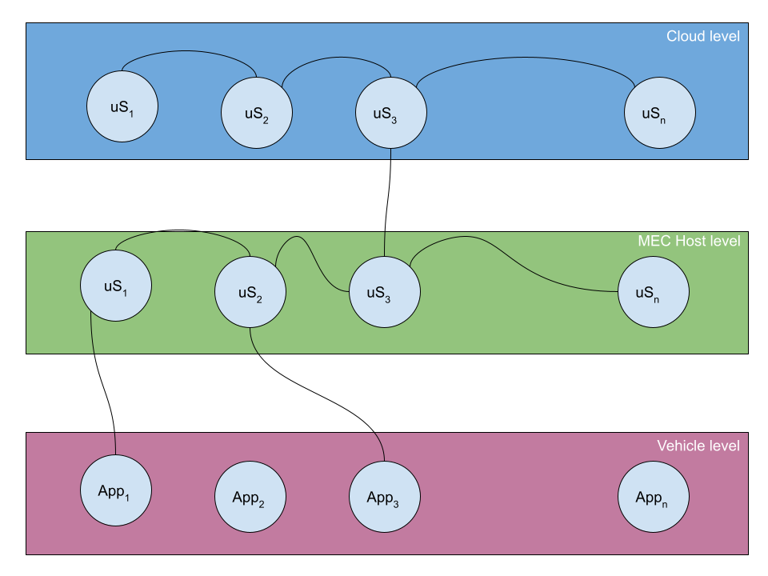
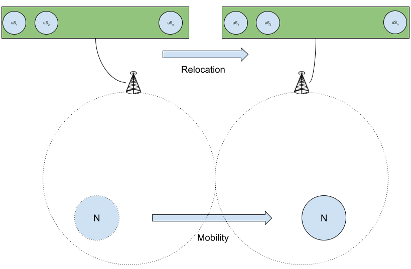

# Personal Webpage
-----------------------------------------------------------------------------------------------------------
<p align="center"> 

</p>

This is sort of a README file for myself.

  * CHERIF Bilel
  * email : bilelcherifdz@gmail.com, bcherif@laas.fr

```c                                                                 


┏━━━┳┓╋┏┳━┓╋┏┓
┃┏━━┫┃╋┃┃┃┗┓┃┃
┃┗━━┫┃╋┃┃┏┓┗┛┃
┃┏━━┫┃╋┃┃┃┗┓┃┃
┃┃╋╋┃┗━┛┃┃╋┃┃┃
┗┛╋╋┗━━━┻┛╋┗━┛
                                 ┏┓╋┏┳━━━┳━┓┏━┓  ┏━━━┳┓╋┏┳┓╋╋┏━━━┳━━━┓
                                 ┃┃╋┃┃┏━━┻┓┗┛┏┛  ┃┏━┓┃┃╋┃┃┃╋╋┃┏━━┫┏━┓┃
                                 ┃┗━┛┃┗━━┓┗┓┏┛╋  ┃┗━┛┃┃╋┃┃┃╋╋┃┗━━┫┗━━┓
                                 ┃┏━┓┃┏━━┛┏┛┗┓╋  ┃┏┓┏┫┃╋┃┃┃╋┏┫┏━━┻━━┓┃
                                 ┃┃╋┃┃┗━━┳┛┏┓┗┓  ┃┃┃┗┫┗━┛┃┗━┛┃┗━━┫┗━┛┃
                                 ┗┛╋┗┻━━━┻━┛┗━┛  ┗┛┗━┻━━━┻━━━┻━━━┻━━━┛
==========================================================================
| ---------------------------Spread knowledge----------------------------|
|------------------------------------------------------- Try this at home|
==========================================================================
1. Have fun doing what you're doing.
2. Work hard for your goals.
3. Code at home and hack Some devices.
4. Share and geek talk.
5. Play Music.

Bilel@me:~/brain/knowledge$ ./share

```
# Academic Degrees
-----------------------------------------------------------------------------------------------------------
* [Since 2017] PhD student at LAAS-CNRS
Thesis: Devellopement of mobile cooperative reliable application
Case of study: Cooperative collision warning application for connected vehicle

* [2016] Master degree in embedded and micro-embedded Systems
Paul Sabatier university, Toulouse

* [2016] Research master degree in electronics and embedded systems
Polytechnical School, Oran

* [2015] Engineer grade in electronics and embedded systems
Polytechnical School, Oran 

* [2015] FIE: Entrepreneurial Innovation Training

# Internships
-----------------------------------------------------------------------------------------------------------
* LAAS-CNRS (Research Lab)
Microsatellite test platform (Cubesat type)
* Sarl FCMCT (polysterene shaping company)
Polysterene CNC machine
* Algeria Telecom (telco company)
Cable maintenance optimization.
* GRTE (electricity distribution company)
Team management and chat tool.

# Projects
-----------------------------------------------------------------------------------------------------------
* Docker based Mobile Edge Computing test bed
* Fault injection based cubesat testing platform
* Vision based tracking robot
* RF based obstacle avoidance robot

# Research Activities
-----------------------------------------------------------------------------------------------------------
* Software testing

* Connected vehicles

* Mobile edge computing

# Teaching Experiences
-----------------------------------------------------------------------------------------------------------
As a phd student i was in charge or codesign teaching activity at INSA University. Codesign is fun going through the whole process of profiling your system till the partitioning is an elightment. The purpose of this course is to give a brief view about hybrid socs, hardware acceleration, and software/hardware development. This field allows you to explore different architecture artistically from placing your hardware design to optimizing your software for custom applications.

[Course page](https://xobx-cherif.github.io/zynq_be/)

| Course | Class | Contract hours |
|:-------------------:|:-----------:|:-----------:|
| dimensioning and evaluation of architectures |	Course/Tutorials/Project	|	64h	|
| dimensioning and evaluation of architectures |	Course/Tutorials/Project	|	64h	|
| dimensioning and evaluation of architectures |	Course/Tutorials/Project	|	64h	|


# Main Projects
-----------------------------------------------------------------------------------------------------------
## Cubesat project
During my internship at LAAS-CNRS I studied the different test techniques for a cubesat type satellite. I realized a test platform for this type of satellite.

The goal of my internship was to realize a test platform for this type of miniature satellites. I realized a prototype of a test platform which is based on the technique of fault injection and sniffing of the different packets by drawing inspiration from other research work in different contexts. My research led me to focus on the different faults that can be caused by radiation in a space environment.
I identified three types of faults, mainly those faults that can occur because of physical perturbations on communication protocols. An implementation of the platform has been done with the nodejs. This implementation offers multiple choices of test in the form of a single test or several successive tests in the form of a text file. Unfortunately I didn't have access to a satellite motherboard, I used a Discovery board to simulate the communication with an OBC of a cubesat. The whole test platform was implemented on a raspberry pi board.

| | | |
|:-------------------------:|:-------------------------:|:-------------------------:|
||  ||
|  |  ||
|  |

My work was concretized by some tests for two types of protocols (The I2C protocol and the CSP protocol). The results obtained show that the native I2C protocol is not too well adapted to projection with simulated radiation effects.

## Mobile edge computing for connected vehicles
My thesis topic is around the development of a reliable cooperative mobile application (connected automotive case study). The subject has evolved through several changes from decentralized communication technology to mobile edge computing (MEC). My research work has been focused on the study of the application deployment infrastructure for the connected automobile up to the different effects of the global system characteristic (deployment platform and vehicle). One of the important characteristic of this type of systems is the high mobility of the nodes (vehicle). As illustrated in Figure 1, the division of an application into microservices makes the application much more flexible in terms of deployment and relocation. The mobility factor requires special treatment of the application by the deployment platform. The design of such an application requires an explicit inclusion of vehicle mobility. The use of a scenario modeling language (TERMOS) was part of my initial thesis topic.

<p align="center"> 

</p>

The research conducted during my thesis proved that the microservice architecture is the most adapted to this type of system. Primary tests through a simulation/emulation platform have shown that this architecture partially meets the constraint of high mobility (without taking into account the aspect of time constraints). These primary tests completely neglect all aspects of the network propagation model.

<p align="center"> 

</p>

The use of a scenario language with implicit mobility facilitates the representation of the different properties of this type of system. Figure 2 illustrates a standard distribution model for this type of application as a microservice. Experiments with this type of architecture show that cutting-edge criteria must be respected to ensure proper operation, maintenance and provisioning of the application.

# Fun projects
----------------------------------------------------------------------------------------------------------- 
Being grown in maker environments i tend to spend most of my free time working on personal projects and learning new stuffs. 

| Thing              | Link        |
| :-------------------: | :-----------: |
| Bilamo robot | [Video](https://youtu.be/7m5QN5-YHf4) |
| Bilamo robot | [Video](https://youtu.be/ccX16GOuImU) |
| Doccuments machine | [Video](https://youtu.be/iQxdYZjNuMo) |
| Portal of power | [Video](https://www.youtube.com/) |
| Kinect | [Video](https://www.youtube.com/) |
| Royal circle | [Video](https://www.youtube.com/) |
| Line follower | [Video](https://youtu.be/FCZV3j5T98o) |
| Royal circle | [Video](https://www.youtube.com/) |

# Papers, Seminary, and Reports
-----------------------------------------------------------------------------------------------------------
## Papers
* Bilel CHERIF, Pascal BERTHOU, Yann LABIT 2019. Testbed for Multi-access Edge Computing V2X applications prototyping and evaluation, 10th EMBEDDED REAL TIME SYSTEMS European Congress (ERTS 2020), Toulouse , Long Paper
## Seminary
* Continental - LAAS-CNRS 2017 Seminary
* Continental - LAAS-CNRS 2018 Seminary
* Continental - LAAS-CNRS 2019 Seminary
* SARA 2018 Seminary
## Technical Reports
* Continental 2017 H2020 Project Report
* Continental 2018 H2020 Project Report
* Continental 2019 H2020 Project Report


# Activities
-----------------------------------------------------------------------------------------------------------

# Hobbies
-----------------------------------------------------------------------------------------------------------
Music is some sort of a universal language that intrigate your feeling without even learning to react to it.

* Electronic gadgets hack

* Coding projects

* Music composition

* Playing guitar

* Swimming

# Philosophy
-----------------------------------------------------------------------------------------------------------

# Writeups
-----------------------------------------------------------------------------------------------------------

  ```c
  
 .----------------.  .----------------.  .----------------.  .----------------. 
| .--------------. || .--------------. || .--------------. || .--------------. |
| |  _______     | || |     ____     | || |     ______   | || |  ___  ____   | |
| | |_   __ \    | || |   .'    `.   | || |   .' ___  |  | || | |_  ||_  _|  | |
| |   | |__) |   | || |  /  .--.  \  | || |  / .'   \_|  | || |   | |_/ /    | |
| |   |  __ /    | || |  | |    | |  | || |  | |         | || |   |  __'.    | |
| |  _| |  \ \_  | || |  \  `--'  /  | || |  \ `.___.'\  | || |  _| |  \ \_  | |
| | |____| |___| | || |   `.____.'   | || |   `._____.'  | || | |____||____| | |
| |              | || |              | || |              | || |              | |
| '--------------' || '--------------' || '--------------' || '--------------' |
 '----------------'  '----------------'  '----------------'  '----------------' 
     
===============================================================================
| ----------------------------------Ba byee-----------------------------------|
|---------------------------------------------------------------- Good luck!!!|
===============================================================================

Bilel@me:~/brain/knowledge$ ./bilel
Bilel@me:~/brain/knowledge$ Press any key to rock and roll: 

```
