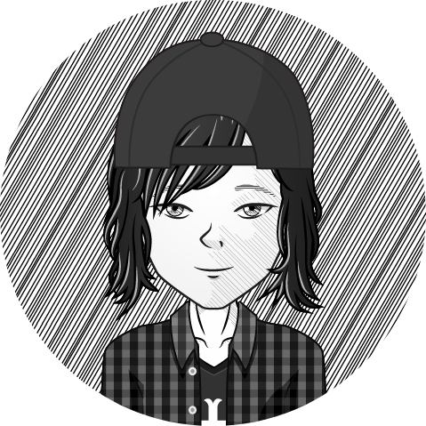

# Personal Webpage
-----------------------------------------------------------------------------------------------------------
<p align="center"> 

</p>

  * CHERIF Bilel
  * email : bilelcherifdz@gmail.com, bcherif@laas.fr

```c                                                                 


┏━━━┳┓╋┏┳━┓╋┏┓
┃┏━━┫┃╋┃┃┃┗┓┃┃
┃┗━━┫┃╋┃┃┏┓┗┛┃
┃┏━━┫┃╋┃┃┃┗┓┃┃
┃┃╋╋┃┗━┛┃┃╋┃┃┃
┗┛╋╋┗━━━┻┛╋┗━┛
                                 ┏┓╋┏┳━━━┳━┓┏━┓  ┏━━━┳┓╋┏┳┓╋╋┏━━━┳━━━┓
                                 ┃┃╋┃┃┏━━┻┓┗┛┏┛  ┃┏━┓┃┃╋┃┃┃╋╋┃┏━━┫┏━┓┃
                                 ┃┗━┛┃┗━━┓┗┓┏┛╋  ┃┗━┛┃┃╋┃┃┃╋╋┃┗━━┫┗━━┓
                                 ┃┏━┓┃┏━━┛┏┛┗┓╋  ┃┏┓┏┫┃╋┃┃┃╋┏┫┏━━┻━━┓┃
                                 ┃┃╋┃┃┗━━┳┛┏┓┗┓  ┃┃┃┗┫┗━┛┃┗━┛┃┗━━┫┗━┛┃
                                 ┗┛╋┗┻━━━┻━┛┗━┛  ┗┛┗━┻━━━┻━━━┻━━━┻━━━┛
==========================================================================
| ---------------------------Spread knowledge----------------------------|
|------------------------------------------------------- Try this at home|
==========================================================================
1. Have fun doing what you're doing.
2. Work hard for your goals.
3. Code at home and hack Some devices.
4. Share and geek talk.
5. Play Music

Bilel@me:~/brain/knowledge$ ./share

```
# Academic Degrees
-----------------------------------------------------------------------------------------------------------
* [Since 2017] PhD student at LAAS-CNRS
Thesis: Devellopement of mobile cooperative reliable application
Case of study: Cooperative collision warning application for connected vehicle

* [2016] Master degree in embedded and micro-embedded Systems
Paul Sabatier university, Toulouse

* [2016] Research master degree in electronics and embedded systems
Polytechnical School, Oran

* [2015] Engineer grade in electronics and embedded systems
Polytechnical School, Oran 

* [2015] FIE: Entrepreneurial Innovation Training

# Internships
-----------------------------------------------------------------------------------------------------------
* LAAS-CNRS (Research Lab)
* Sarl FCMCT (polysterene shaping company)
* Algeria Telecom (telco company)
* GRTE (electricity distribution company)

# Projects
-----------------------------------------------------------------------------------------------------------
* Docker based Mobile Edge Computing test bed
* Fault injection based cubesat testing platform
* Vision based tracking robot
* RF based obstacle avoidance robot

# Research Activities
-----------------------------------------------------------------------------------------------------------
* Software testing

* Connected vehicles

* Mobile edge computing

# Teaching Experiences
-----------------------------------------------------------------------------------------------------------
As a phd student i was in charge or codesign teaching activity at INSA University. Codesign is fun going through the whole process of profiling your system till the partitioning is an elightment. The purpose of this course is to give a brief view about hybrid socs, hardware acceleration, and software/hardware development. This field allows you to explore different architecture artistically from placing your hardware design to optimizing your software for custom applications.

[Course page](https://xobx-cherif.github.io/zynq_be/)

| Course | Class | Contract hours |
|:-------------------:|:-----------:|:-----------:|
| Bilamo robot |		|		|
| Bilamo robot |		|		|
| Doccuments machine |		|		|


# Technical Experiences
-----------------------------------------------------------------------------------------------------------

# Fun projects
----------------------------------------------------------------------------------------------------------- 
Being grown in maker environments i tend to spend most of my free time working on personal projects and learning new stuffs. 

| Thing              | Link        |
| :-------------------: | :-----------: |
| Bilamo robot | [Video](https://www.youtube.com/) |
| Bilamo robot | [Video](https://www.youtube.com/) |
| Doccuments machine | [Video](https://www.youtube.com/) |
| Portal of power | [Video](https://www.youtube.com/) |
| Kinect | [Video](https://www.youtube.com/) |
| Royal circle | [Video](https://www.youtube.com/) |
| Line follower | [Video](https://www.youtube.com/) |
| Royal circle | [Video](https://www.youtube.com/) |

# Papers, Seminary, and Reports
-----------------------------------------------------------------------------------------------------------

# Activities
-----------------------------------------------------------------------------------------------------------

# Hobbies
-----------------------------------------------------------------------------------------------------------
Music is some sort of a universal language that intrigate your feeling without even learning to react to it.

*

*

*

# Philosophy
-----------------------------------------------------------------------------------------------------------

# Writeups
-----------------------------------------------------------------------------------------------------------

  ```c
  
 .----------------.  .----------------.  .----------------.  .----------------. 
| .--------------. || .--------------. || .--------------. || .--------------. |
| |  _______     | || |     ____     | || |     ______   | || |  ___  ____   | |
| | |_   __ \    | || |   .'    `.   | || |   .' ___  |  | || | |_  ||_  _|  | |
| |   | |__) |   | || |  /  .--.  \  | || |  / .'   \_|  | || |   | |_/ /    | |
| |   |  __ /    | || |  | |    | |  | || |  | |         | || |   |  __'.    | |
| |  _| |  \ \_  | || |  \  `--'  /  | || |  \ `.___.'\  | || |  _| |  \ \_  | |
| | |____| |___| | || |   `.____.'   | || |   `._____.'  | || | |____||____| | |
| |              | || |              | || |              | || |              | |
| '--------------' || '--------------' || '--------------' || '--------------' |
 '----------------'  '----------------'  '----------------'  '----------------' 
     
===============================================================================
| ----------------------------------Ba byee-----------------------------------|
|---------------------------------------------------------------- Good luck!!!|
===============================================================================

Bilel@me:~/brain/knowledge$ ./bilel
Bilel@me:~/brain/knowledge$ Press any key to rock and roll: 

```
